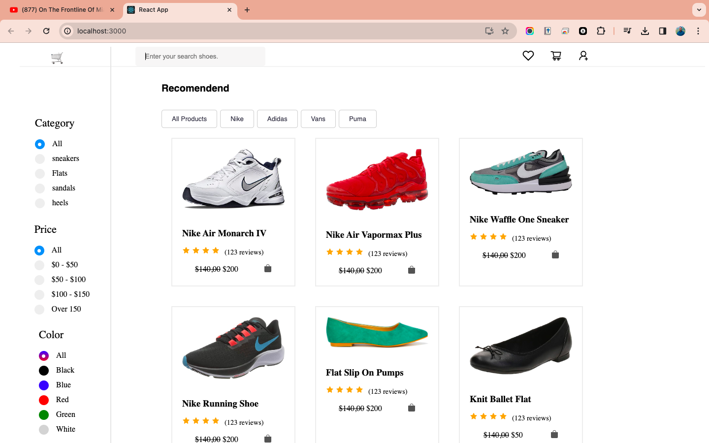

# React Shoes Store Project

[](https://youtu.be/3dMbF3LcTos)

# **🎥 [Click on the THUMBNAIL to Experience the Demo Video!](https://youtu.be/3dMbF3LcTos)** 🚀

## Overview

Welcome to the React Shoes Store project! This is the front-end for a shoe shopping platform, allowing users to browse and search for shoes, add them to their cart, and complete the checkout process. The front-end is built using React, Redux, and React Router.

## Features

- Browse and search for shoes by category, brand, price, and color.
- Add shoes to your cart and complete the checkout.
- View your order history.
- Manage your account information.

## Requirements

Before getting started, make sure you have the following installed:

- Node.js
- Yarn

## Installation

To set up the front-end, follow these steps:

1. Clone this repository to your local machine.
2. Open your terminal and navigate to the project directory.
3. Run the following commands:

```bash
yarn install
yarn start
This will start the development server on port 3000. You can then open your browser and go to http://localhost:3000 to view the front-end.

Deployment
To deploy the front-end to production, you can choose from various services like Netlify, Vercel, or Heroku. Once you've selected a service, follow their instructions to deploy your front-end.

Usage
To use the front-end, simply open your browser and navigate to http://localhost:3000. From there, you can browse and search for shoes, add them to your cart, and complete the checkout.

Contributing
We welcome contributions to improve the front-end. If you have any suggestions or bug fixes, please create a pull request. We appreciate your help in making this project even better!

License
The front-end is licensed under the MIT License.

Happy shoe shopping with React Shoes Store! 🥿👟👞
```
